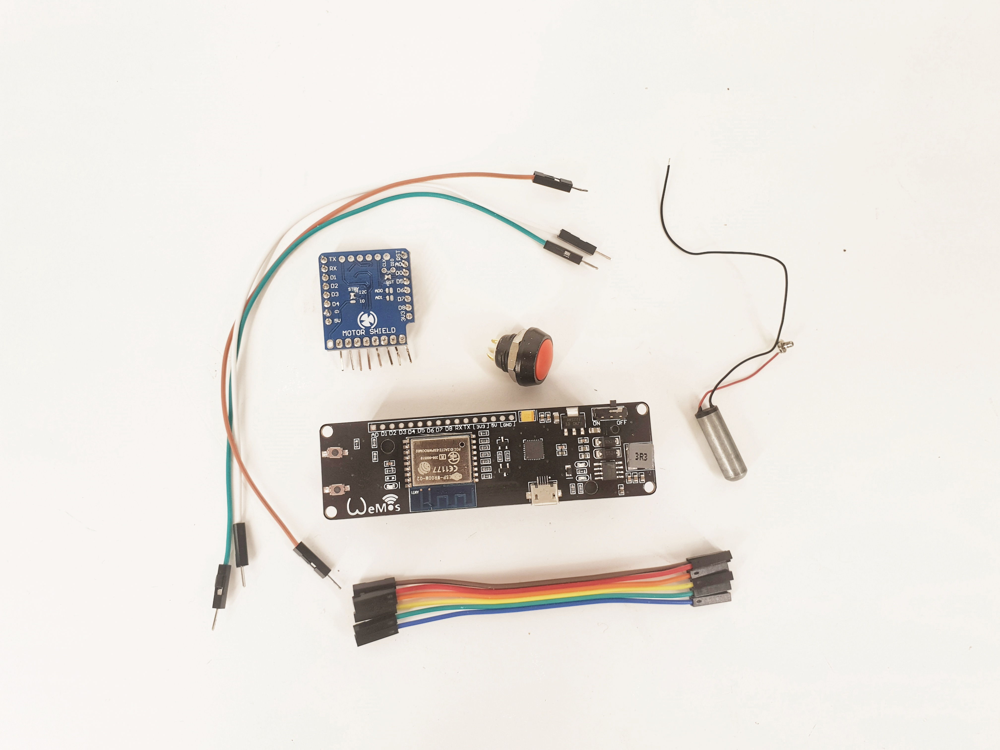
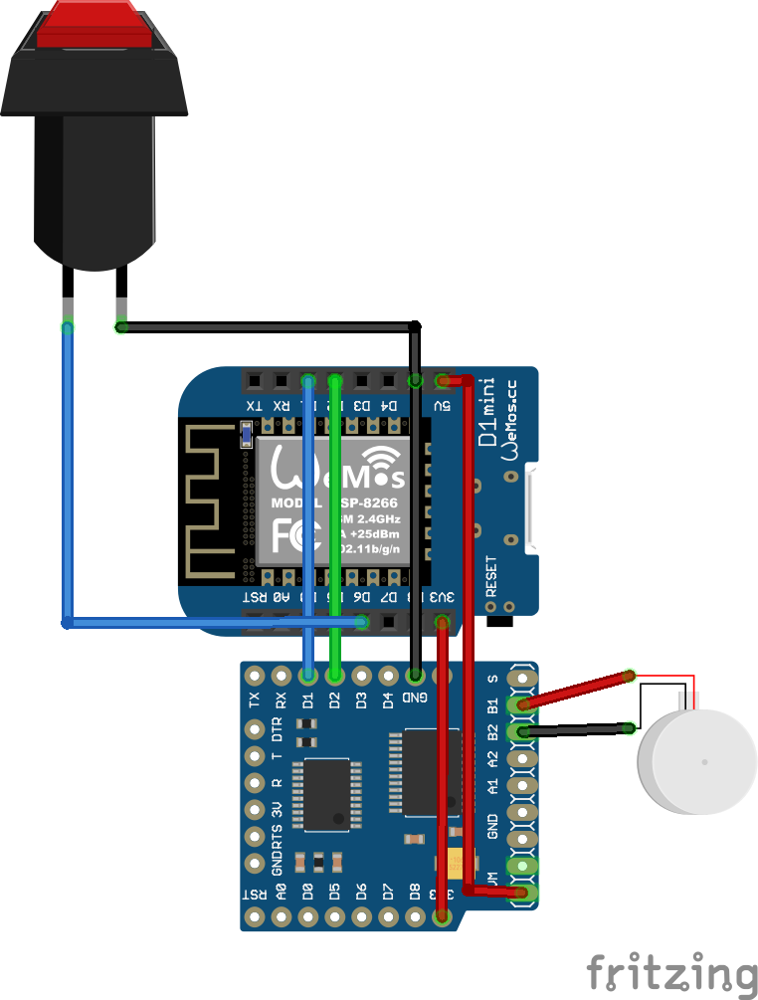
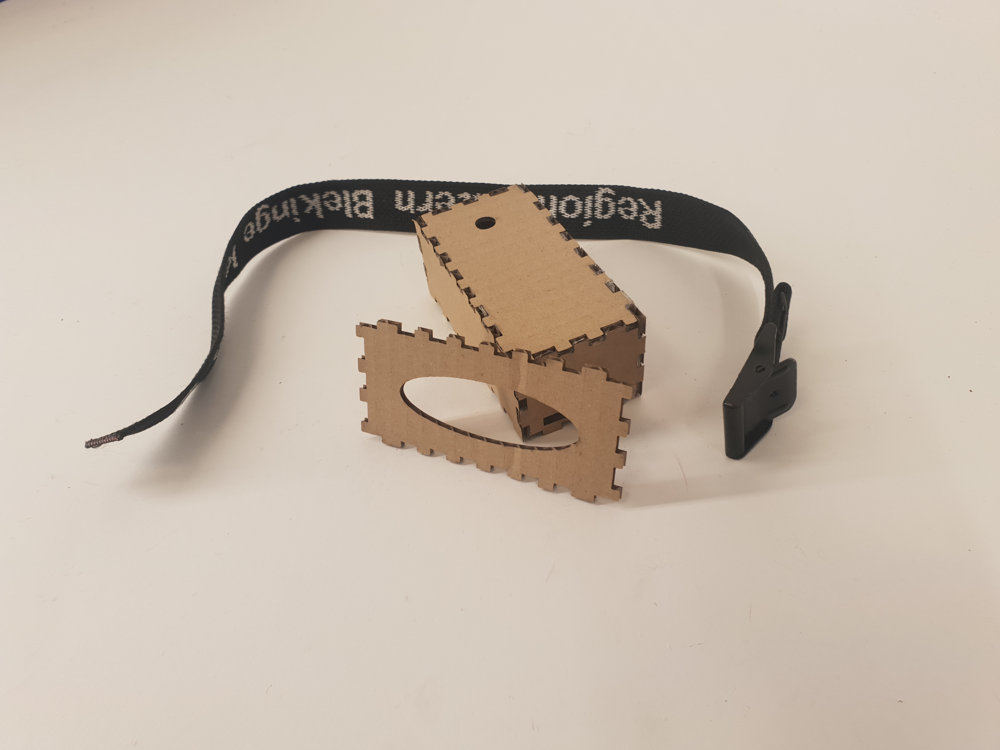

# PIEHaptics

Vision:
We want to explore what it does to relations over a distance, when it becomes possible and easily available, to induce physical sensations remotely.

Our approach is to create two identical devices that are connected to each other over the internet. A button and a motor are attached to the devices where a button click on the <b>1. device</b> is able to deliver a haptic sensation on the <b>2. device</b> and vice versa.

## Structure of this Git.
This Git-repository will contain the relevant source code and resources necessary for you to make a device identical to what we have made. The code-pieces is structured in a way for you to see what have been done (i.e. added) in the iterations we have gone through. The source code for a respective iteration can be found in folders named in the following way "X. Iteration", where X describes which iteration is at play. A rule of thumb would be to use the source code found in the folder where the X is highest, at that code would be the prettiest.

Below is a brief explanation of the code in each respective iteration:

### 1. Iteration
Source code for using the MQTT-protocol, where the ADAFruit.io was used for a graphical control interface as well as a MQTT-broker.

### 2. Iteration
The primary focus in the 2. Iteration was to enable the devices to <b>subscribe</b> to each others <b>publish</b> feeds. When one of the devices would register a change in the other device's publisher feed, code would be executed, that would power on the vibration motor for a fixed amount of time.

### 3. Iteration
In this iteration we wanted to make the haptic sensations more dynamic. We did this by shifting from the approach using a fixed value of active motor time, to an approach where the length a button press on the <b>1. device</b> would determine the length of the motor time on the <b>2. device</b>.
This code is programmed for device 1. Remember to change the variables for 'id' and 'idOther' for the 2. device.
Remember also to type in your own Wifi name and password.
The code is made for a device which uses motor B. If you use motor A or both, then remember to uncomment them in the code.

Additionally you will be able to find the .SVG-file for lasercutting the case for the device. This file is named "HAPTICCASE-3MM.svg"

## Before your assemble the device you should upload the code to the Wemos board 

If you don't have the Wemos installed, you can follow the beginning of this guide:
http://fablab.ruc.dk/wemos-intro/

Besides this, you should make feeds on an account on io.adafruit.com. There needs to be 3 feeds. A feed for each of the devices and one to ping the devices. If you dont make continous pings, the devices will "fall asleep" in lack of a better word. We named the feeds:

Default heartbeat

Person-1 buttonPublisher

Person-2 buttonPublisher

You make these feeds on the io.adafruit.com site by logging in on your user and then clicking on feeds.
When on the feeds site you can choose actions->Create a new feed. 
We grouped our feeds so heartbeat is in the default group. Person-1 and Person-2 is new groups with their own buttonPublisher feed. 

## How to create an internet enabled haptic sensoric sender and receiver

### 1. Preparing the necessary parts and pieces
#### Parts:
* WEMOS D1 Mini (https://wiki.wemos.cc/products:d1:d1_mini) or similar ESP8266 microcontroller (we used one with a built-in rechargable battery)
* Motor Shield (https://wiki.wemos.cc/products:d1_mini_shields:motor_shield) 
* Button
* Motor of your choice (our favourite is the vibration motor)
* Wires
#### Tools:
* Soldering iron and solder
* Laser cutter

#### Fritzing diagram
We have created a solution based on the Fritzing diagram below

### 2. Soldering the pins and connecting the motor shield
Everything should be soldered according to the Fritzing-diagram above. To make our device durable, we further secured the connections with glue-gun glue. Make sure you test all of your connections before doing anything like that. 
### 3. Soldering on the vibration motor
Instead of soldering on the motor directly to the motor-shield, we soldered on two proto cables with a female end. This allowed us to test out different motors (soldering proto cables with male ends on the motor). If you only have one motor, this won't matter.  
### 4. Soldering on the button
We are using the INPUT_PULLUP pinMode, that uses the internal resistor in the WEMOS/Arduino-board. Therefor a resistor is not necessary. 
### 5. Creating the enclosure

For this exact iteration, we wanted to create an enclosure to strap to the body. For creating and mounting the device, we did the following steps:

- We used a lasercutter to cut the box, and then used a gluegun to put it together. The file for our enclosure, can be found in this repository. It is made for 3 mm hardboard/HDF. 
- Next, we put straps inside the enclosure, to make sure that we could wear the device.
- For mounting the device itself, we screwed the top of the button off, put the device into the enclosure, and put the disassempled button through the small hole seen in the picture of the enclosure. 
- If you're using a 'normal' wemos and attaching an external battery of some sort, you will most likely need to alter the case. We would still recomming being able to strap it to your body, as a way to secure it in one place.

### 6. Putting it all together
The box is made for a wemos-board with a built-in rechargable battery. The board should be put in place, so that the square hole in the front of the box, line up with the micro-usb port on the board. This allows for recharging and/or editing the code. The button should be mounted in the circular hole. fit the rest of the board and the motorshield inside the box, pull a strap through the holes in the sides (either horizontal or vertical), and pull the vibration motor out, so that it is outside the strap in the big hole on the backside of the box. When strapping the device to your body, the strap should push the motor into your body. 
Repeat with the other device, and you're ready to vibrate! 

